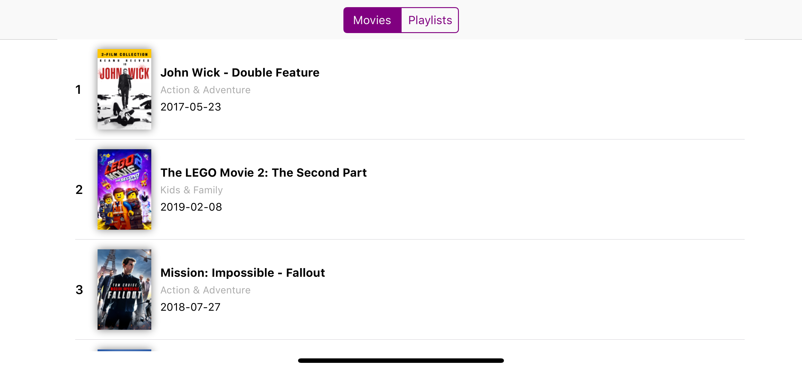
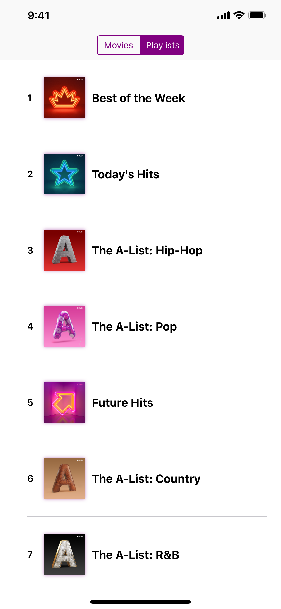
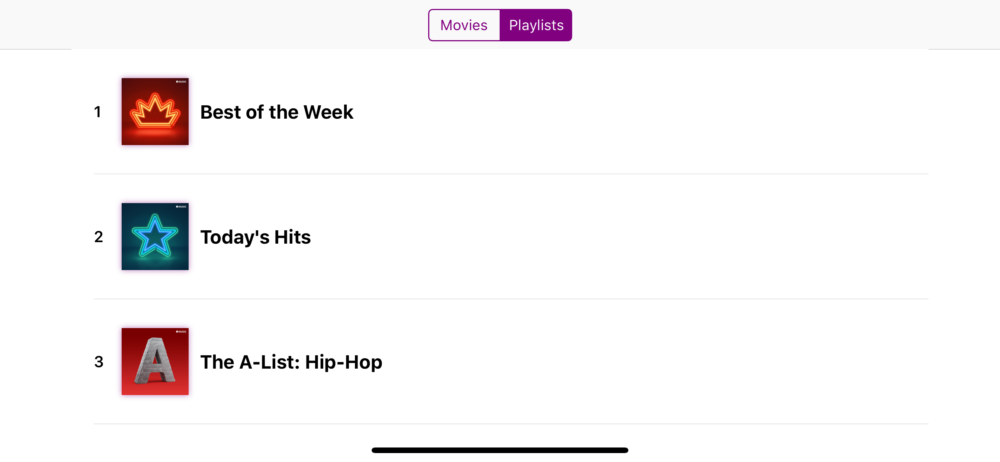

# TopTop

Challenge to build a programatically UI under an hour, displaying media types in a table view fetched from some API.

Since the goal was to make it under an hour, I did not factor out generic code, did not use childs view controllers and so on.

## Screenshots

